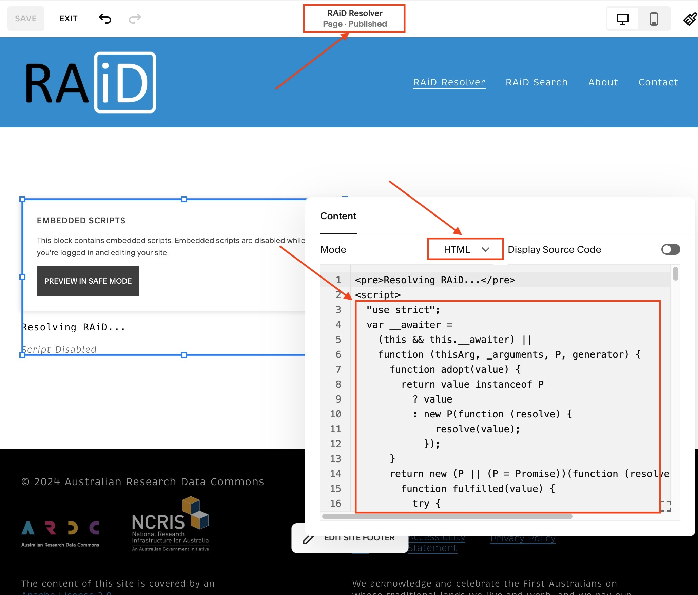

# RAiD.org Redirect Script

The RAiD.org page is currently hosted on Squarespace. While Squarespace doesn't allow us to read path segments from URLs, we need to extract the prefix and suffix from URLs to call the DataCite API. As a workaround, we can inject a script into a custom 404 page titled "RAiD Resolver." This allows us to read the URL parameters, call the DataCite API with these parameters, and redirect to the URL obtained from DataCite's alternateIdentifiers field.

To build the code run `npm run build`. The resulting ES5 JavaScript code to be injected into the Squarespace page can then be found at `./dist/index.js`.

Make sure to insert the code between the script tags on the `RAiD Resolver` Squarespace page:

```html
<pre>Resolving RAiD...</pre>
<script>
  // Paste code here //
</script>
```


